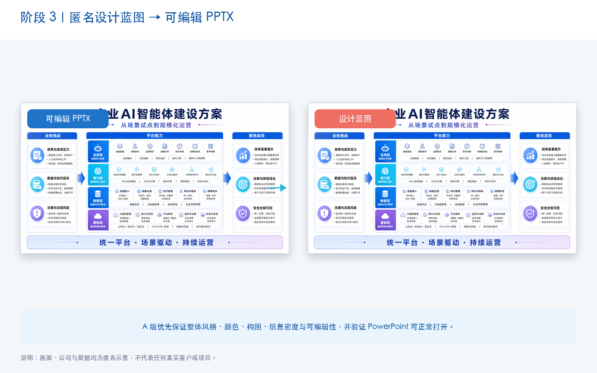
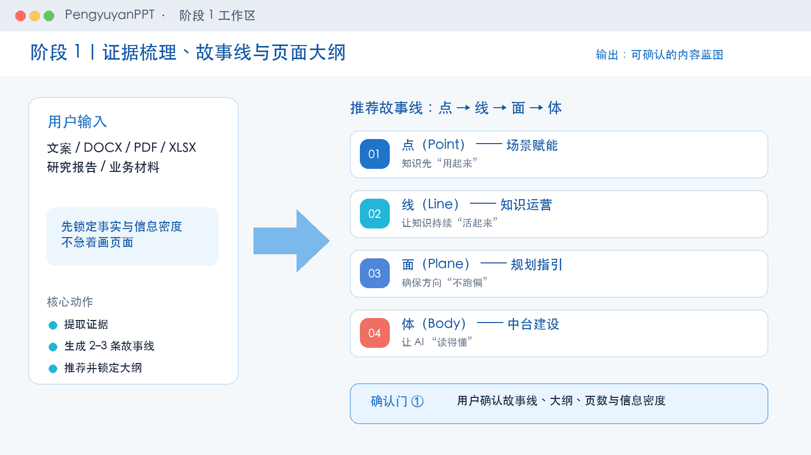
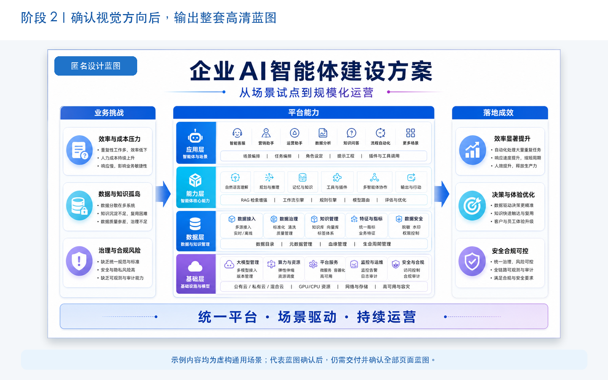
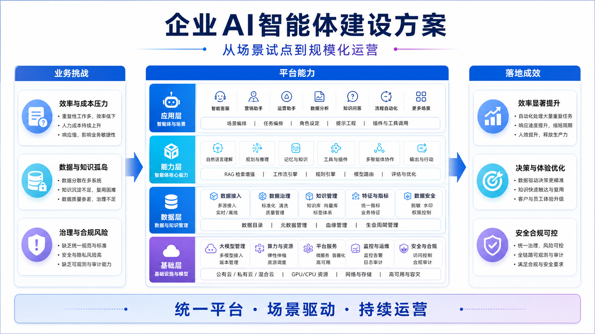
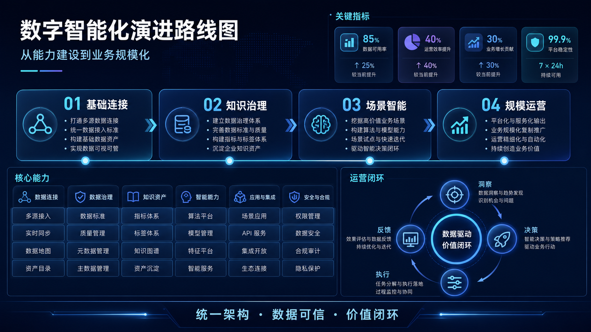

# PengyuyanPPT

> 把业务材料先变成可确认的内容与设计蓝图，再变成高信息密度、可编辑、可正常打开的 PowerPoint。

[](SKILL.md)
[](#阶段-3蓝图还原为可编辑-pptx)
[](LICENSE)

[简体中文](README.md) · [繁體中文](README.zh-TW.md) · [English](README.en.md) · [日本語](README.ja.md) · [한국어](README.ko.md) · [Français](README.fr.md) · [Português](README.pt.md) · [Español](README.es.md) · [العربية](README.ar.md)

PengyuyanPPT 是面向 Codex 的专业 PPT Skill，适合把文案、DOCX、PDF、TXT、XLSX、研究报告、业务方案或已完成的设计蓝图，转化为咨询式、高信息密度、主要内容可编辑的 PPTX。

它不是简单套模板，而是把 PPT 制作拆成三个可确认阶段：

1. 先确认讲什么；
2. 再确认长什么样；
3. 最后转换为可编辑 PowerPoint。



> 隐私说明：README 中的画面、企业、场景和数据均为匿名虚构示意，不代表任何真实客户或项目。

## 适合什么任务

- 行业研究、企业战略、品牌与市场分析；
- 高管汇报、董事会材料、客户提案与项目复盘；
- 知识管理、AI 解决方案、数字化转型与产品方案；
- 已有 PPT 截图、设计稿或 ImageGen 蓝图的可编辑还原；
- 多页、高密度、强调结论与证据的业务演示文稿。

对于演讲型、极简型、个人叙事型 PPT，也可以指定风格使用，但本 Skill 默认更擅长业务信息密集型页面。

## 两种使用入口

| 入口 | 你提供什么 | 执行路径 | 最终输出 |
|---|---|---|---|
| 内容到 PPT | 文案、文档、数据、报告、业务材料 | 阶段 1 → 阶段 2 → 阶段 3 | 完整可编辑 PPTX |
| 蓝图到 PPT | 完整设计稿、幻灯片截图、Image2/ImageGen 蓝图 | 快速锁定内容与视觉 → 阶段 3 | 按蓝图还原的可编辑 PPTX |

材料和蓝图同时存在时：材料锁定事实，蓝图锁定视觉。

## 三阶段工作流

### 阶段 1：证据、故事线与页面大纲

先读懂材料，不急着画页面。

- 提取事实、数字、单位、期间、来源和 caveat；
- 生成并比较 2–3 条故事线；
- 使用 SCR、issue tree 或 hypothesis tree 收敛逻辑；
- 确认页数、逐页结论、图表计划、信息密度和组件清单。

**阶段输出：** 可确认的故事线与逐页内容大纲。



### 阶段 2：视觉方向与整套高清蓝图

先确认一张代表蓝图，再生成整套蓝图。

- 8 种内置风格只作为参考，不是强制限制；
- 可以指定企业模板、品牌色、参考图或任意 Image2/ImageGen 风格；
- 代表页确认后固化色板、字体、网格、组件、图标与信息密度；
- 必须先输出并确认全部页面蓝图，不能边做蓝图边制作 PPTX。
- 对外展示或进入公开仓库的蓝图，必须移除真实公司名、Logo、客户名、人员信息和业务数据，统一使用匿名示例。

**阶段输出：** 每页独立高清蓝图、整套缩略图总览和页码清单。



> 代表蓝图确认，只代表视觉方向锁定；只有整套蓝图确认后，才能进入阶段 3。

### 阶段 3：蓝图还原为可编辑 PPTX

阶段 3 采用 A/B 两段式交付，优先把时间花在真正影响使用的部分。

#### A：可用版快速交付（默认）

A 版不是低保真草稿。它必须保证：

- 风格、颜色、构图、排版和信息密度与蓝图基本一致；
- 标题、正文、数字、表格、流程、图表标签和结论条可编辑；
- 中文、字体与图标正常显示；
- PPTX 能在 Microsoft PowerPoint 中打开且没有修复警告。

第一张 A 版样板交付后立即暂停，由用户决定是否已经满足使用要求。

#### B：蓝图一致性精修（可选）

只有用户选择 B，才继续处理最后约 10% 的差异，例如复杂曲线、图标细节、阴影、圆角、间距、换行和局部坐标。

| 档位 | 适合场景 | 默认验证 |
|---|---|---|
| A / fast | 业务使用优先、快速交付 | 结构、内容、可编辑性、PowerPoint 兼容性 |
| B / standard | 需要进一步接近蓝图 | PowerPoint 渲染、蓝图对照、P0/P1 修正 |
| precision | 像素级、品牌/UI、复杂核心几何 | 元素测量、局部差异、严格门禁 |

多页任务只在第一张可编辑样板页询问一次 A/B；用户确定标准后，其余页面按同一标准批量转换并合并。

## 四个确认门

```text
内容与故事线确认
        ↓
代表蓝图确认
        ↓
整套蓝图确认
        ↓
第一张可编辑样板 A/B 确认 → 批量生成其余页面
```

这个设计避免 AI 在故事线、视觉设计和批量还原之间同时分散注意力，也把“是否值得继续精修”的选择权交给用户。

## 核心能力

- **证据驱动：** 从多种业务材料中抽取可追溯事实，不凭蓝图或常识补造数据；
- **咨询式表达：** 结论型标题、主体分析、证据案例、解释层和 SO WHAT；
- **开放视觉：** 支持内置样张、用户指定风格、企业模板和任意生成式蓝图；
- **高密度蓝图：** 不为了方便转 PPT 而降级成低保真线框；
- **可编辑还原：** 主要文字、数字、表格、图表与流程使用 PowerPoint 原生对象；
- **快速 A 版：** 先交付约 90% 可用状态，通过兼容性检查后暂停；
- **按需精修：** 用户选择 B 后才启动蓝图对照和多轮一致性修正；
- **多页复用：** 通过 `visual_master` 固化字体、色板、网格、面板和组件；
- **稳定图标：** 项目缓存、本地聚合库、开源 SVG、PowerPoint/Fluent 与语义近似多级回退；
- **质量校验：** 提供 PPTX 结构、对象边界、内容、可编辑性和视觉门禁脚本。

## 图标策略

普通图标的目标是“语义准确、风格统一、PowerPoint 稳定显示”，不要求逐像素描摹。

默认优先级：

```text
项目缓存
→ 本地聚合图标库
→ 可发现的开源 SVG 库
→ PowerPoint / Fluent 图标
→ 同风格语义近似
→ 必要时自绘
```

内置风格族包括 `chunk-filled`、`tabler-filled`、`tabler-outline`、`phosphor-duotone` 和 `simple-icons`，也可扩展 Lucide、Remix Icon、Heroicons、Material Symbols、Bootstrap Icons、Fluent UI System Icons 与 Carbon Icons。

## 风格参考

以下两张图仅作为科技方案汇报的视觉方向示意。实际蓝图不受固定风格限制，可根据品牌色、模板或参考图重新设计。图中文字与数据均为匿名虚构内容。

| 科技方案浅色风格 | 数字智能深色风格 |
|---|---|
|  |  |

## 安装

### macOS / Linux

```bash
git clone https://github.com/GZPengyuyan/PengyuyanPPT.git \
  "$HOME/.codex/skills/pengyuyan-ppt-skill"
```

### Windows PowerShell

```powershell
git clone https://github.com/GZPengyuyan/PengyuyanPPT.git `
  "$env:USERPROFILE\.codex\skills\pengyuyan-ppt-skill"
```

安装后确认目录根部存在 `SKILL.md`，重新启动或刷新 Codex 会话。

## 怎么用

### 从材料完整制作 PPT

```text
使用 $pengyuyan-ppt-skill，根据我上传的业务材料制作一份高密度、可编辑的 PPT。
先执行阶段 1，给我确认故事线、页数和逐页大纲。
```

### 直接把蓝图转成可编辑 PPT

```text
使用 $pengyuyan-ppt-skill 执行第三阶段。
这张设计蓝图已经确认，请还原成可编辑 PPTX，先交付 A 版并验证 PowerPoint 能正常打开。
```

### 多页任务

```text
先完成并交付全部页面蓝图给我确认；全部蓝图确认后，再选择一张代表页制作可编辑 A 版样板。
我的第一次 A/B 选择用于后续全部页面。
```

## 更新

```bash
cd "$HOME/.codex/skills/pengyuyan-ppt-skill"
git pull
```

Windows PowerShell：

```powershell
cd "$env:USERPROFILE\.codex\skills\pengyuyan-ppt-skill"
git pull
```

## 目录结构

```text
pengyuyan-ppt-skill/
├── SKILL.md                 # 入口、阶段与确认门
├── agents/openai.yaml       # Codex UI 元数据
├── references/              # 内容、视觉、生产、图标与 QA 规则
├── scripts/                 # 内容锁定、图标检索、测量和 PPTX 校验
└── assets/                  # 风格样张、图标库与 README 截图
```

## 校验工具

A 版默认运行非严格结构检查：

```bash
python3 scripts/validate_pptx.py deck.pptx --json-out qa.json
```

像素级或严格交付可提供 manifest 与视觉 QA：

```bash
python3 scripts/validate_pptx.py deck.pptx \
  --manifest slide_manifest.json \
  --visual-qa visual_qa_gate.json \
  --strict --json-out qa.json
```

## 设计原则

- 真实材料决定事实，蓝图决定视觉；
- 先确认内容，再确认蓝图，最后生产 PPTX；
- A 版优先解决“可用、可编辑、可打开”；
- B 版才追求最后一段视觉一致性；
- 不把整页蓝图截图当成最终 PPT 背景；
- 不为了速度删除已确认的信息区、案例、表格、关键数字或结论。

## License

MIT，详见 [LICENSE](LICENSE)。

## Acknowledgments

[Tabler Icons](https://github.com/tabler/tabler-icons) · [Simple Icons](https://github.com/simple-icons/simple-icons) · [Phosphor Icons](https://github.com/phosphor-icons/core) · [SVG Repo](https://www.svgrepo.com/)
